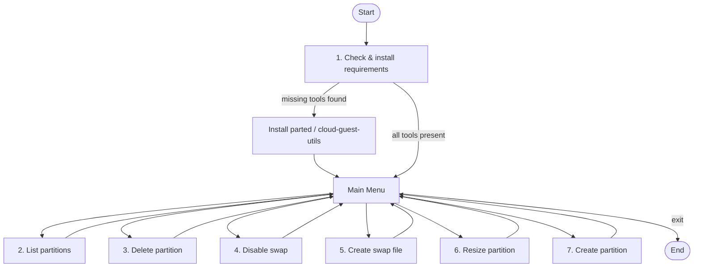

# Partition Management Tools

A single-purpose disk and partition utility script ([`disk_tool.py`](disk_tool.py)) that wraps common partition, swap, and filesystem administration tasks behind a simple menu-driven interface.

> **Warning:** This tool operates on disks, partitions, and swap state. Several actions are destructive or system-sensitive. Review the target device and prefer dry-run or explicit confirmation before committing changes.

---

---

## How it works



---

## Requirements

The script relies on a few OS-level utilities in addition to the standard Python library. The first menu option checks for these dependencies and installs any that are missing.

### OS-level tools

| Tool | Purpose |
|------|---------|
| `parted` | Partition table inspection, deletion, and resizing |
| `cloud-guest-utils` | Guest utilities (e.g. `growpart`) used to expand partitions to the full available disk |

### Python

- Python 3 (standard library only — no third-party packages required)

---

## Features

### 1. Check & install requirements

Verifies that the required OS-level tools are present and installs any missing ones, from OS level down to the Python runtime.

### 2. List partitions

Displays an overview of the current disk layout:

- The list of partitions.
- Available physical disk size.
- Actual logical disk size of each partition.

### 3. Delete partition

Removes a selected partition from the disk.

### 4. Disable swap (`swapoff`)

Turns off swap:

- A specific swap partition of your choice.
- All swap partitions at once.

### 5. Create swap file

Creates a swap file and enables it.

**Sample commands:**

```bash
sudo fallocate -l 4G /swapfile
sudo chmod 600 /swapfile
sudo mkswap /swapfile
sudo swapon /swapfile
```

**Optional — persist across reboots** by adding an entry to `/etc/fstab`:

```text
/swapfile none swap sw 0 0
```

### 6. Resize partition

Expands a partition to use available disk space:

- Resize a partition to **100%** of the available disk:

  ```bash
  parted /dev/sda
  resize part 2 100%
  ```

- Resize a partition by a specific amount, e.g. `+1G` or `+2G`.

### 7. Create partition

Creates a new partition on a selected disk:

- Choose the target disk.
- Specify the partition size (or use the remaining free space).
- Optionally set the filesystem type.

**Sample commands:**

```bash
sudo parted /dev/sda
mkpart primary ext4 1MiB 10GiB
```

## Safety notes

- Always confirm the target device before deleting or resizing.
- Resizing or deleting partitions can result in **data loss**.
- Prefer running with root privileges only when an action requires it.
